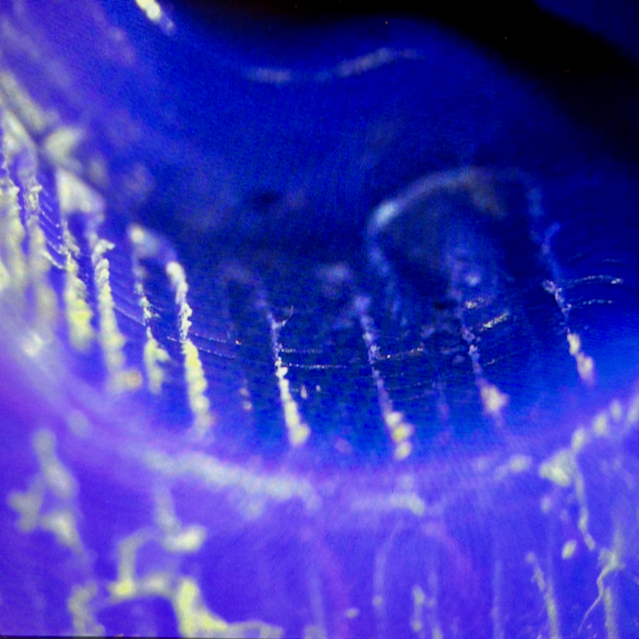
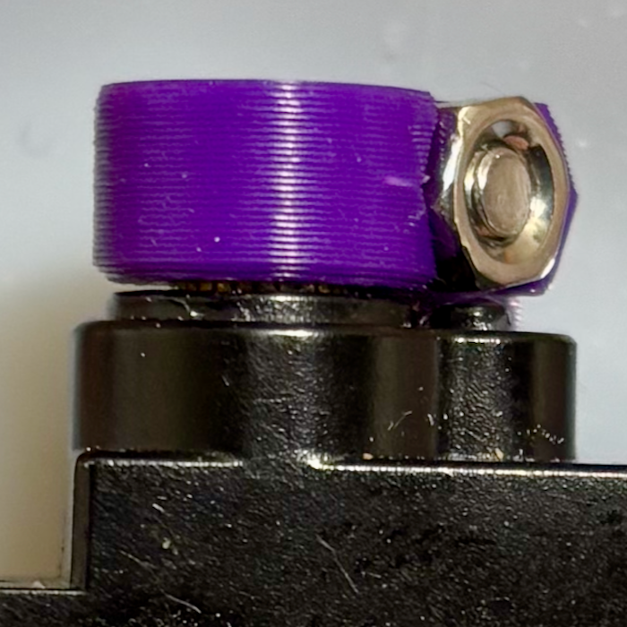

# Universal Servo Horn for ERCF v2 Community MMU

## Description

This is a more robust, universal drop in replacement for the ERCF v2 Community Edition servo horn for Savox, GDW, and SG90 servos commonly used with this MMU. Unlike the existing horn, its printed on its side with layers running in the same direction as the ERCF tophats to reduce friction and allow more preload tension on the filament when engaged. Instead of printed splines which are prone to stripping, it clamps in place, imprinting on the splines to create a strong mechanical connection.

Print as oriented in ABS or ABS equilvent filament. Install the 10mm M3 BHCS and and tighten just enough to seat the semi-captive M3 hex nut before attaching the horn to the servo. Also inspect the sole where it engages with the tophat for any high spots and if necessary use a fine file / fine sandpaper to lightly smooth any ridges to make it more uniform. 

**Installation:** I find it easier to install by setting the ERCF servo to the ``move`` rather than ``up`` position (``MMU_SERVO pos=move``) before attaching and positioning the horn on the servo until you can move the carriage without it catching or rubbing on tophats. Confirm the sole of the horn is parallel to the servo and once happy, secure and seat the horn in place using the provided servo screw before tightening the M3 BHCS to clamp and imprint the servo splines until it doesn’t move or wiggle. As Savox servo screws tend to be reasonably short, you may need to press and rock the horn a little to seat it before you can get the screw to engage. The servo screw only needs to be tight enough to seat the horn as all the load is handled by the M3 BHCS and clamping action. While the M3 compression screw needs to be reasonably tight, take care not to overtighten it and deform or snap the horn. If you see clear filament "stress" marks you have overtightened it.

Once its secure, check and set / update your Happy Hare servo ``up``, ``move``, and ``down`` positions as these may have changed (``MMU_SERVO ANGLE=<angle>`` followed by ``MMU_SERVO POS=<up|down|move> SAVE=1`` to save the angle for each position).

If you are unfortunate enough to strip the splines (which is hard to do), you should be able to retighten the M3 clamp 1-2 times before needing to reprint and replace the horn. 

Print multiple so you have spares or if you feel the need to reposition it on the servo. 

Arm mounted to GDW, SG90 and Savox servos. 

## Change Log

* Published
